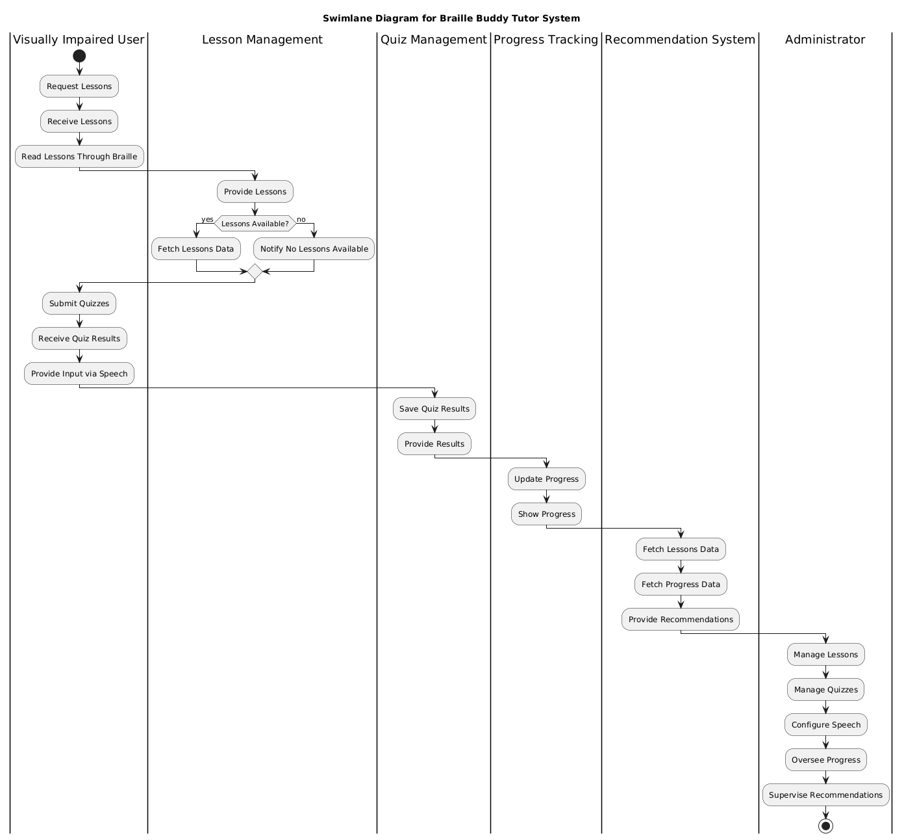

# Braille Buddy

**Braille Buddy** is an educational device designed to enhance Braille literacy among visually impaired individuals. This project combines tactile and auditory methods to create a comprehensive and interactive learning system.

## Features

- **Tactile Interface:** A refreshable Braille display that allows users to feel and read Braille text through physical touch, offering an immersive learning experience.
- **Auditory Feedback:** Integrated audio feedback provides spoken instructions, making the learning process multisensory.
- **Interactive and Adaptive Learning:** Personalized lessons, adaptive quizzes, and real-time feedback tailored to each user's learning needs.
- **Affordable and Accessible:** Designed with cost-effective components like Raspberry Pi and Push Pull Solenoids, making Braille education more accessible.

## Technology Stack

### Hardware
- **Raspberry Pi:** Central processing unit for managing input/output and running the software stack.
- **Refreshable Braille Display:** Enables users to access tactile Braille text.
- **Speech Synthesis Hardware:** Includes microphone and speakers for voice input and auditory feedback.

### Software
- **Programming Language:** Python for core logic development and hardware interfacing.
- **Machine Learning:** PyTorch for adaptive learning algorithms.
- **Speech Synthesis:** pyttsx3 and speech_recognition for real-time voice feedback and input.
- **Frontend:** React.js and Tailwind CSS for dynamic and accessible UI design.
- **Backend:** Node.js and Express.js for managing asynchronous operations and building RESTful APIs.
- **Database:** MongoDB for storing user data.
<!-- 
## Work Breakdown Structure

1. **Hardware Development:** Design and testing of physical components like the refreshable Braille display and Raspberry Pi integration.
2. **Software Development:** Creation of the user interface, backend processing, database management, and integration of speech synthesis.
3. **Content Creation:** Development of interactive lessons, quizzes, and instructional materials tailored to various learning levels.
4. **Testing and Quality Assurance:** Usability testing with visually impaired users, performance testing, and quality assurance. -->

## Architecture and Diagrams

### System Architecture

### Swimlane Diagram
